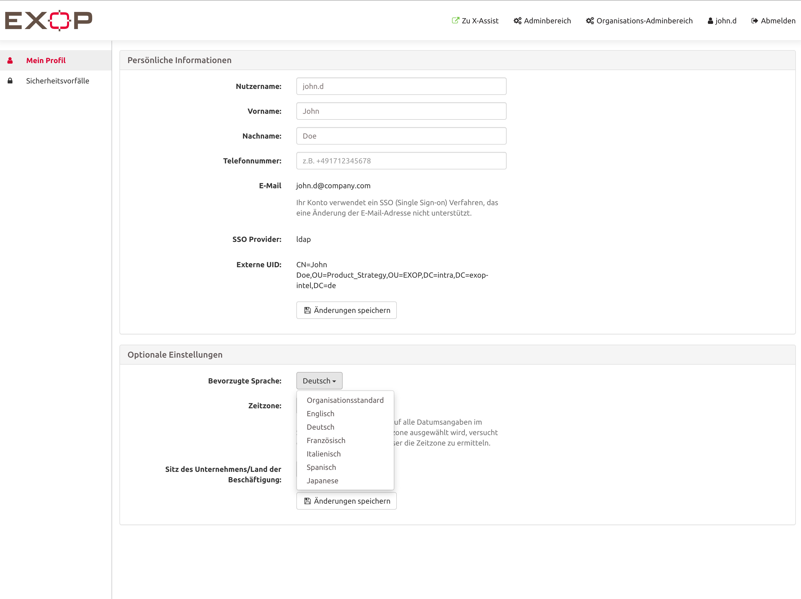

# Nutzerprofil

## Wie kann ich mein persönliches Konto verwalten?

Das Nutzerprofil der Plattform ist ein wichtiges Element. Hier können die Nutzer ihre persönlichen Daten und Einstellungen verwalten. Sie können ihren Namen, ihre E-Mail-Adresse und ihre Telefonnummer festlegen, die als Hauptkontaktdaten für die Plattform in Notfällen und für alle anderen Informationen zur Verfügung stehen.


Die Plattform wird die Kontaktdaten des Nutzerprofils gegenüber den Kontaktdaten aus den automatisch übertragenen Reisedaten priorisieren, da davon ausgegangen wird, dass die von der Person/dem Reisenden angegebenen Daten präziser sind als Daten aus dem Reisebüro.


Darüber hinaus können die Benutzer ihre gewünschte Sprache und Zeitzone auswählen. Wenn sich der Nutzer über Nutzername und Passwort einloggt, kann er hier auch sein Passwort ändern. 

Für zusätzliche Sicherheit können sie auch eine Zwei-Faktor-Authentifizierung für ihr Konto aktivieren. Im Nutzerprofil können Nutzer auch ihr persönliches Beschäftigungsland bestimmen. 


Bitte beachten Sie, dass ein Reisender keine PTI für dieses bestimmte Land erhält, wenn die PTI-Einstellung „Land der Beschäftigung ignorieren" aktiviert ist.


