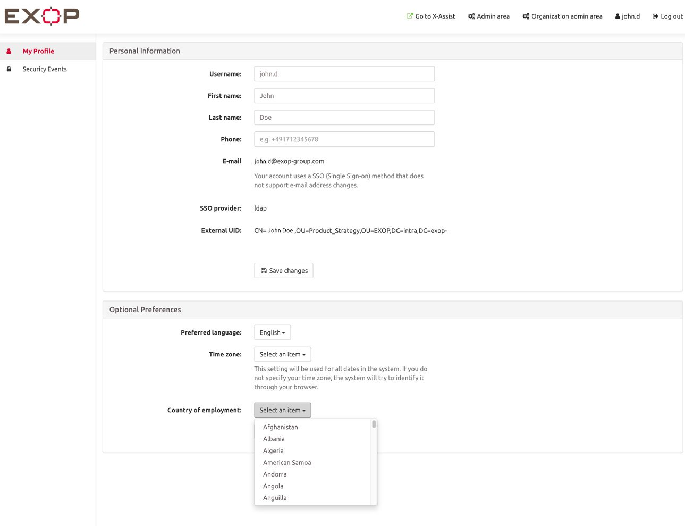

# User Profile

## How can I manage my personal account?

The user profile of the platform is an important element. Here, users can manage their **personal account**. They can set their name, email and phone number that serve as main contact details for the platform in case of emergencies and any other information.


 The platform will prioritise contact details of the user profile over contact details from automatically transferred travel data, as any data provided by the person/ traveller is assumed to be more precise.


In addition, users can select their preferred language and time zone. If user’s login via _username_ and _password_, they can also change their password here. 

For additional safety they can also enable _two-factor authentication_ for their account. Users can also determine their personal country of employment in the user profile. 


Please note that a traveller does not receive PTI for this particular country if the PTI setting “ignore country of employment” is enabled.


