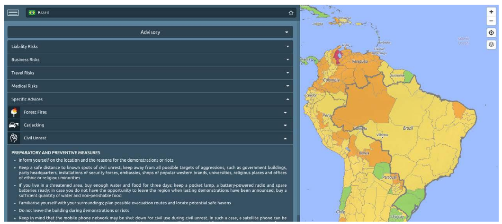

# Advisory

Each country has a list of key recommendations that significantly reduce travel risks, if followed. Much the same counts for medical recommendations. Of particular interest is the section “_specific advices_” which provides special recommendations and detailed information about a specific risk prevalent in the respective country.

