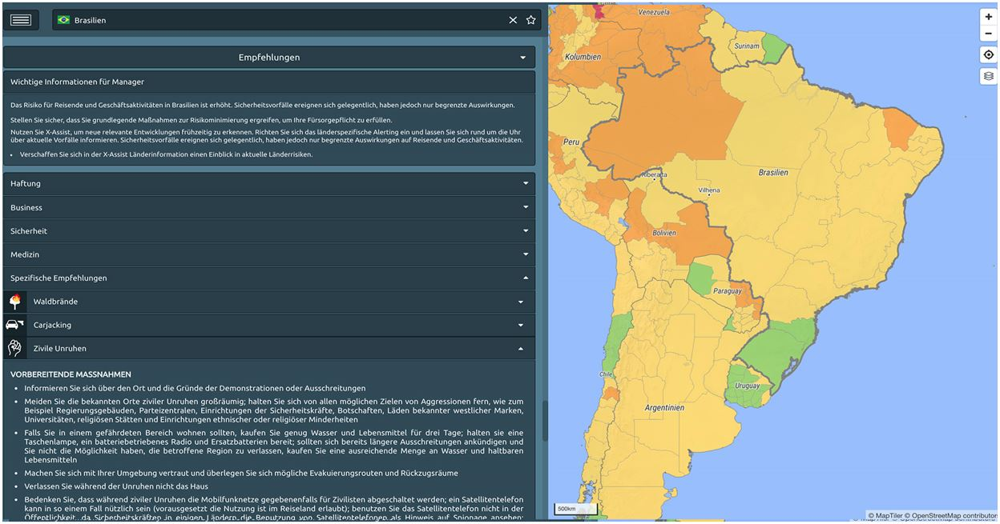

# Empfehlungen

Für jedes Land wird eine Liste von Schlüsselempfehlungen bereitgestellt, um die Risiken für Reisende deutlich reduzieren. Ähnliches gilt für medizinische Empfehlungen. Von besonderem Interesse ist der Abschnitt "Spezifische Empfehlungen", der besondere Empfehlungen und detaillierte Informationen über ein konkretes, in dem jeweiligen Land vorherrschendes Risiko enthält.

