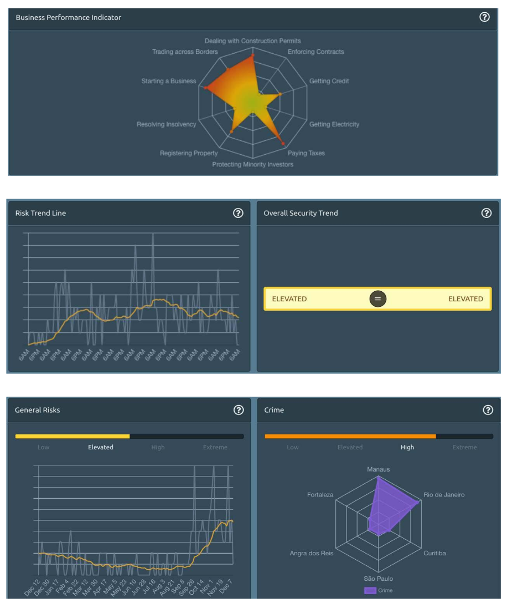

# Charts

Charts provide smart graphics for analytical users. Risk lines, forecasts, upcoming events and risk categorisers – all these visualisations help you better understand an overall risk trend from recent months to today and to identify key risks for travellers at a glance.

