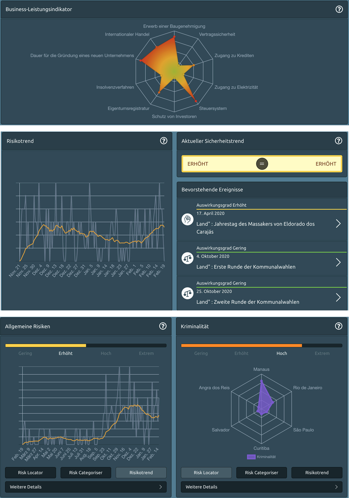

# Diagramme

Diagramme bieten intelligente Grafiken für den analytischen Benutzer. Risikolinien, Prognosen, bevorstehende Ereignisse und Risikokategorisierungen - all diese Visualisierungen helfen Ihnen, einen allgemeinen Risikotrend besser zu verstehen und die wichtigsten Risiken für Reisende auf einen Blick zu erkennen.

