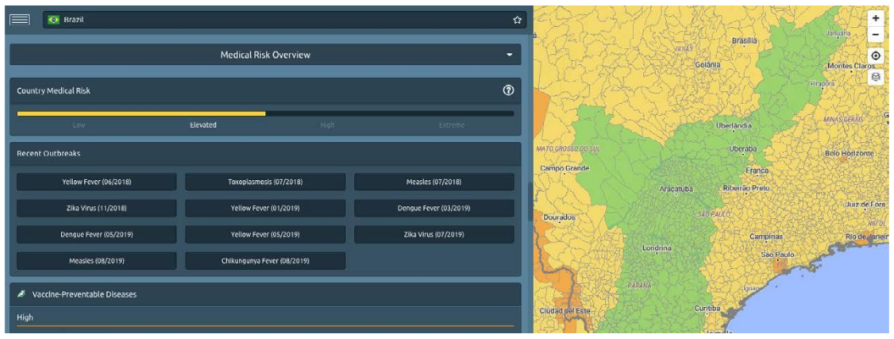

# Medical Risks

Medical precautions must begin long before the trip. The platform lists latest medical events and relevant vaccinable and non-vaccinable diseases, so you and your travellers, together with a physician, can decide how to prepare for the journey well in advance. For those who prefer to work with their own medical sources, all medical information can be deactivated. Activation or deactivation refers to medical risk overview, medical advisory and medical map content.

