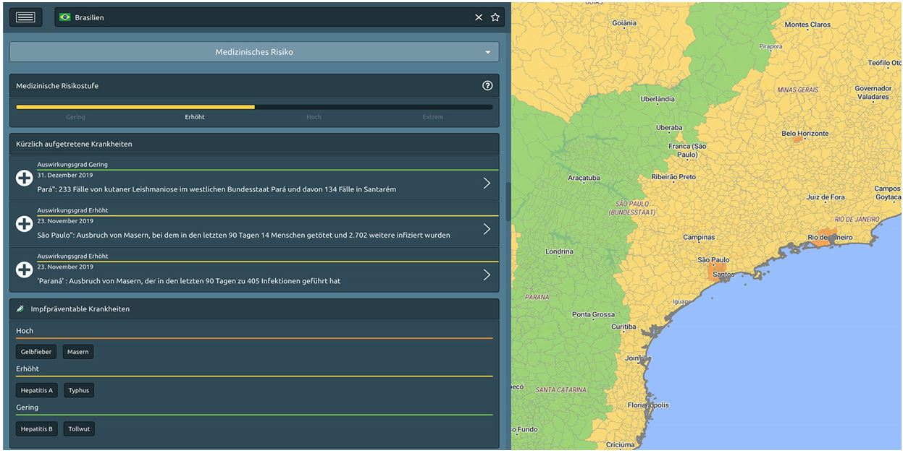

# Medizinische Risiken

Die medizinischen Vorkehrungen müssen mitunter lange vor der Reise beginnen. X-ASSIST listet die neuesten medizinischen Ereignisse sowie impfpräventable und nicht impfpräventable Krankheiten auf, so dass Sie und Ihre Reisenden gemeinsam mit einem Arzt entscheiden können, wie Sie sich rechtzeitig auf die Reise vorbereiten. Für diejenigen, die es bevorzugen, mit ihren eigenen medizinischen Quellen zu arbeiten, können alle medizinischen Informationen deaktiviert werden. Die Aktivierung oder Deaktivierung bezieht sich auf den medizinischen Risikoüberblick, die Empfehlungen, das medizinische Alerting und den medizinischen Karteninhalt.

