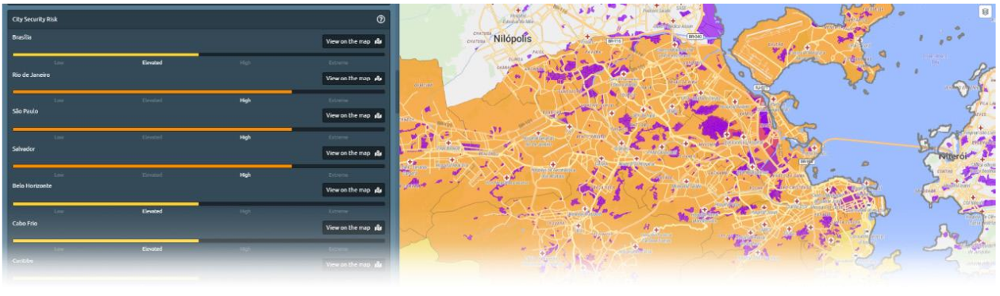

# Risk Overview

Gain a better understanding of the security situation in a country. Crime, civil unrest, terrorism, general risks and governance are all key categories to be assessed to provide a basic country risk portfolio. In addition, our experts identify urban risks for each country’s most relevant cities and add new information on a monthly basis, even revealing no-go areas for travellers.

