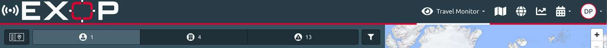

# Getting Started

## DISCOVER THE PLATFORM

There are several basic features that are always visible on the top of each page - the **navigation bar**, the **emergency button** and, on the main pages, the **screen splitter**.

#### NAVIGATION BAR

Start using the platform by checking out the navigation bar. Click/touch the respective icon and get direct access to the **Travel Monitor,** **Risk Map**, **Global Events**, **Country Information** as well as to the **Travel Registration** options. Finally, you can access your profile to administer your personal account or those of others, depending on your permissions.

#### EMERGENCY BUTTON & CHECK IN FEATURE

SHARE YOUR LOCATION AND CALL FOR ASSISTANCE

In critical situations, the traveller can push the emergency button and will be automatically connected with the Operation Center. In addition, the exact location of the traveller will be transmitted to the Operation Center. Therefore, even if the call is disrupted, the Operation Centre will know the location of the traveller and be able to handle the case as an emergency. This feature is specifically important for travellers that are in a life-threatening situation and not able to speak on the phone. The emergency button can serve as silent alarm; simply pushing the button will immediately transmit the traveller’s location to the Operation Centre and trigger subsequent emergency procedures. 

CHECK IN

The check in feature serves as the shortest and most accurate way to submit a traveller’s position to the platform and integrate the person, based on the phone number and email address of his user profile, into the platform monitoring and alerting. The user will be monitored at exactly the geo-coordinates sent by the last check in. Managers can see the traveller and his position in the travel monitor. After seven days with no updated position, the monitoring will be terminated. This function is a huge advantage in cases where position data are rather inaccurate, e.g. if PNR travel data only provide the location of the arrival airport. Also, if there has been no time for another travel registration \(calendar or PNR registration\) at all, with the push of a button, the traveller is being taken care of by the platform’s monitoring and alerting after a few moments.


For further information on emergency assistance options, please see the section assistance settings in the travel monitor chapter.


#### SCREEN SPLITTER / VIEWS

Depending on the size of the screen you use, there are different screen splits available. As you navigate through the different pages and use the platform you can adjust the screen views to your preferences with one or two clicks on the view mode icon, always placed in the upper left corner of the screen. In all mobile views you can switch from the navigation panel to map view with one click on the map icon and back.

