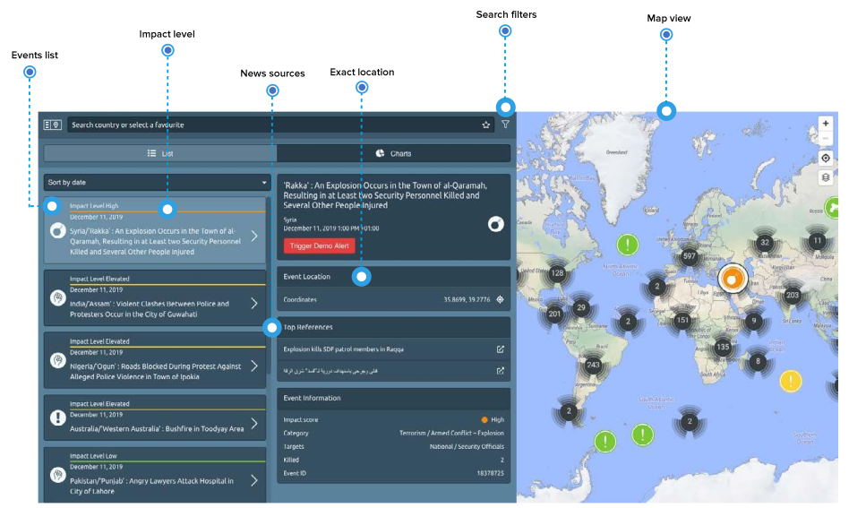
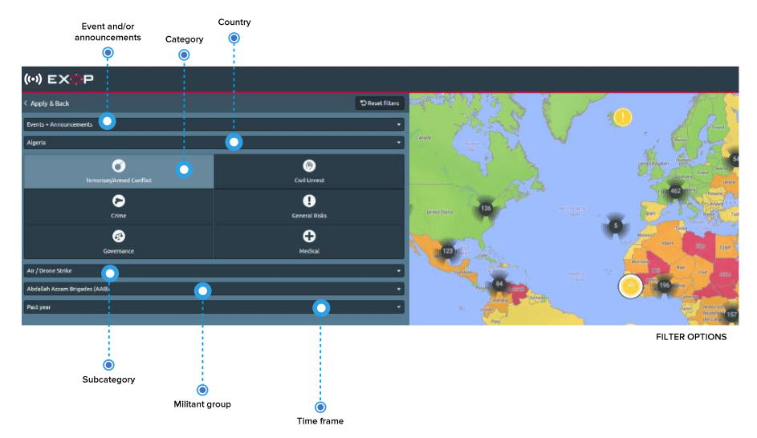

# Events and Incidents

Any event or incident with relevance for security and travel that has been identified over the past years is listed on the **global events page**. 

The events listed provide structured and comparable information such as risk category, date and time, impact and exact location of incidents, added by a direct link to news sources. That way you get an insight to what happened on the ground and consider if security or medical prevention measures have to be adjusted. 

In addition, you and your travellers will be alerted by announcements of future events so you can **minimise the risk and prepare your staff in advance**.

Of course, you need to find out about specific places, topics and times: **You want to know if your travellers face a risk of violent demonstrations when staying in the capital**, or if there are any clashes in the hinterland where your project site is located, or in what seasons do hurricanes bring flooding and destruction to a specific travel destination? **Target your search according to your specific questions** using and combining the multiple filter options.

