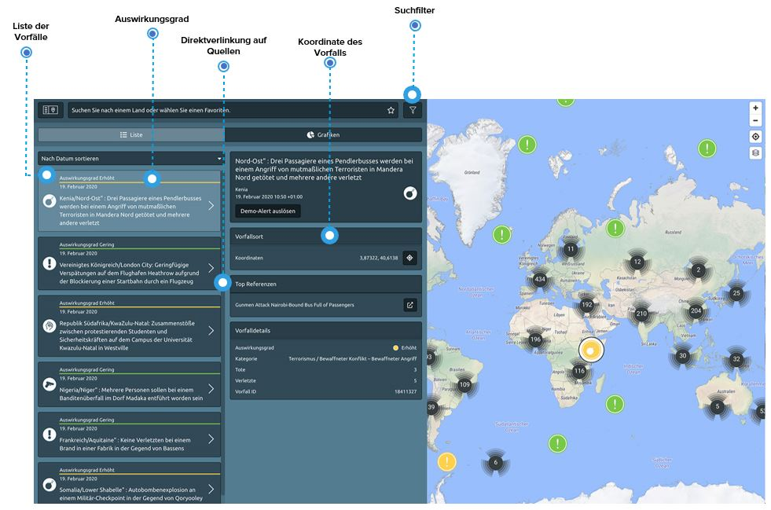
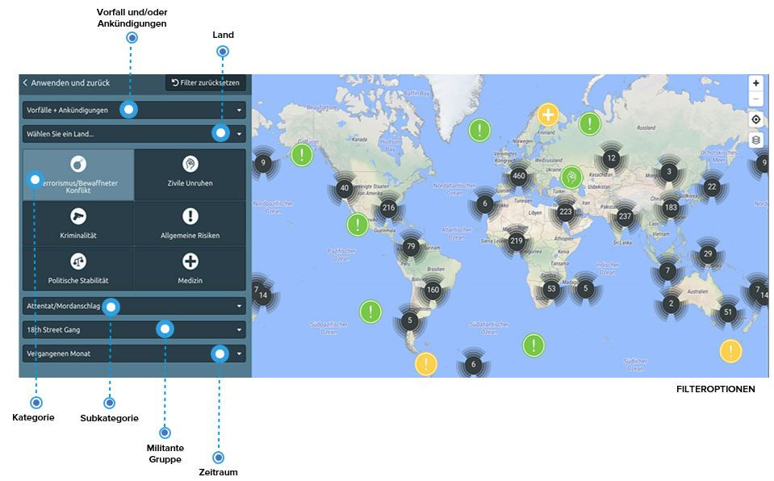

# Ereignisse und Vorfälle

Alle sicherheitsrelevanten Ereignisse oder Vorfälle, welche in den letzten Jahren identifiziert wurden, ist in der Seite „**Globale Vorfälle**“ aufgelistet. 

Die aufgelisteten Ereignisse bieten strukturierte und vergleichbare Informationen wie Risikokategorie, Datum und Zeit, Auswirkungen und den genauen Ort der Vorfälle, ergänzt durch einen direkten Link zu den relevanten Nachrichtenquellen. Auf diese Weise erhalten Sie einen Einblick in die Ereignisse vor Ort und können überlegen, ob Sicherheits- oder medizinische Präventionsmaßnahmen angepasst werden müssen. 

Darüber hinaus werden Sie und Ihre Reisenden durch die Ankündigung von zukünftigen, womöglich kritischen Ereignissen informiert, so dass Sie Ihre Mitarbeiter im Voraus davon informieren und somit **das Risiko minimieren können**.

Wie können Sie sich über bestimmte Orte und Themen informieren? **Sie möchten beispielsweise wissen, ob Ihre Reisenden während des Aufenthalts in einer jeweiligen Stadt dem Risiko gewaltsamer Ausschreitungen ausgesetzt sind**, oder ob es im Umfeld Ihres Projektstandortes öfter zu Konflikten kommt, oder in welchen Jahreszeiten das Risiko von Orkanen an einem bestimmten Reiseziel besonders hoch sind? **Richten Sie Ihre Suche nach Ihren spezifischen Fragen aus**, indem Sie die verschiedenen Filteroptionen verwenden und miteinander kombinieren.

