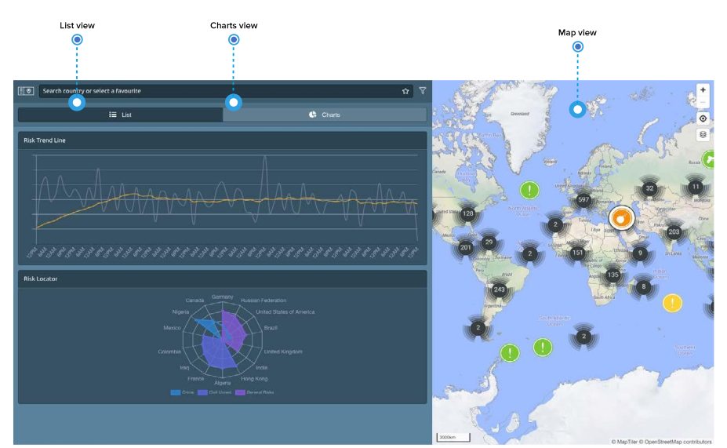

# Multiple Views

To make it more intuitive for you to find what you need, the platform provides **multiple views of the events**. 

In the list view on the left side of the screen you can see the events \(filtered to your needs\) in the specific order of your choice – by date or by impact. Switch to the chart view, and the same events are displayed in a risk trend line or risk locator. These charts help you identify **overall risk trends and major risk locations**. Alternatively, you can navigate through the events using the map and its **multiple map layers** in the corner of the screen to extract the information you need.

