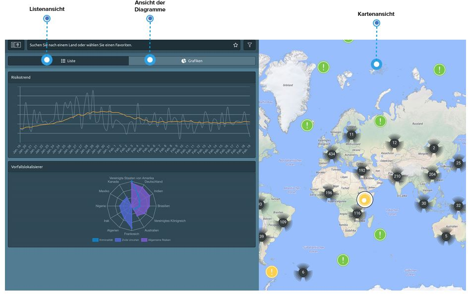

# Verschiedene Ansichten

Um die Suche nach den gewünschten Informationen intuitiver zu gestalten, bietet die Plattform **mehrere Ansichten der Ereignisse**. 

In der Listenansicht auf der linken Seite des Bildschirms sehen Sie die Ereignisse \(gefiltert nach Ihren Kriterien\) in der von Ihnen gewünschten Reihenfolge - nach Datum oder nach Auswirkungen. Wenn Sie in die Grafikansicht wechseln, werden Ihnen dieselben Ereignisse in einer **Risiko-Trendlinie** oder einem **Vorfallslokalisator** angezeigt. Diese Grafiken helfen Ihnen dabei, allgemeine Risikotrends und die wichtigsten Risikoorte schnell zu identifizieren. Alternativ können Sie durch die Ereignisse mit Hilfe der Karte und den verschiedenen Kartenebenen in der Ecke des Bildschirms navigieren, um die benötigten Informationen zu finden.

