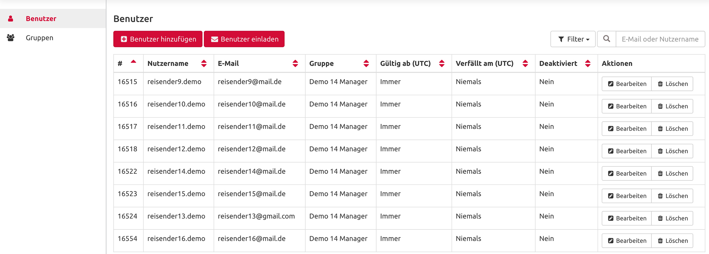

# Nutzer Login

### LOGIN OPTIONEN – Wählen Sie Ihr Login-Verfahren

Die Plattform ermöglicht Ihren Mitarbeitern einen einfachen Login-Prozess. Je nach dem von Ihnen verwendeten Produkt bietet die Plattform verschiedene Möglichkeiten. Mit einem BASIC-Zugang kann der Administrator neue Benutzer auf die Plattform einladen oder einfach neue Benutzer direkt aus dem Adminbereich hinzufügen. Die Standardanmeldung für alle Produkte erfolgt über Nutzername und Passwort.

Die ADVANCED-Plattformversion bietet Ihnen zwei zusätzliche Möglichkeiten für die Integration neuer Benutzer und die Anmeldung im System.

### SIGN-ON SCHNITTSTELLE

E-Mail-Token

Mit der auf E-Mail-Token basierenden Single-Sign-On-Authentifizierung erhalten alle Mitarbeiter, die über eine persönliche Firmen-E-Mail-Adresse verfügen, Zugang zur Plattform, ohne dass sie einen Nutzernamen oder ein Passwort benötigen. Zu diesem Zweck gibt es eine spezielle Login-Seite für Ihr Unternehmen. Ein Benutzer gibt seine Firmen-E-Mail-Adresse ein und erhält einen 24 Stunden gültigen Login-Link per E-Mail an die gleiche E-Mail-Adresse. Sie finden diesen Link im Adminbereich unter Organisation. Hier geben Sie auch eine Whitelist der erlaubten Firmendomains an, für die das Login möglich ist.


Top Vorteil: Dieses Verfahren ist technisch schnell und einfach zu implementieren. Jeder mit einer Firmen-E-Mail-Adresse kann sich in das System einloggen, ohne einen Nutzernamen und ein Passwort verwalten zu müssen.


#### **SAML 2.0** 

Beim Single-Sign-On-Verfahren auf Basis von SAML 2.0 wird die Anmeldung in die Benutzerauthentifi-zierung des Unternehmens integriert. Sobald sich ein Benutzer bei der Infrastruktur des Unternehmens authentifiziert hat, ist er automatisch bei der Plattform angemeldet, indem er einfach auf einen bestimmten Link im Intranet des Unternehmens klickt. Um SAML 2.0 anzuwenden, geben Sie die Konfiguration für SAML an und Ihre IT-Abteilung kann die Plattform in das Intranet Ihres Unternehmens integrieren. 


Top Vorteil: Die Plattform ist in Ihr Intranet integriert. Es ist kein separates Benutzer-Login, kein zusätzlicher Nutzername und kein Passwort erforderlich.


### 

