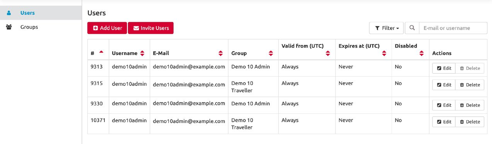

# User Login

### LOGIN OPTIONS – Choose your login procedure

The platform makes the login process easy for your employees. Depending on the product you use, the platform offers various options. With a BASIC access, the administrator can invite new users to the platform, or simply add new users directly out of the admin area. The default login for all products is via username and password.

The ADVANCED platform version offers you two additional interfaces for integrating new users and logins.

### SIGN-ON INTERFACES

#### Email token

With the Single Sign-on authentication based on email tokens, all employees who have a personal company email address are given access to the platform without any username or password. For this purpose, a special login page for your company exists. A user will enter his company email address and will receive a login link valid for 24 hours via email to the same email address. You will find this link in the admin area under organisation. Here you also specify a whitelist of allowed company domains for which the login is possible.


Top advantage: This procedure is technically fast and easy to implement. Everyone with a company email address can login to the system, without a username and password that have to be saved and remembered.


#### **SAML 2.0** 

With the single sign-on procedure based on SAML 2.0, the login is integrated into the company’s user authentication process. Once a user is authenticated to the company’s infrastructure, the user will automatically login to the platform by simply clicking a specified link on the company intranet. In order to apply SAML 2.0, you specify the configuration for SAML in the admin area under organisation and your IT can integrate the platform into your company intranet. 


Top advantage: The platform is integrated into your intranet with. No separate user login is necessary, no additional username and password is required.


### 

