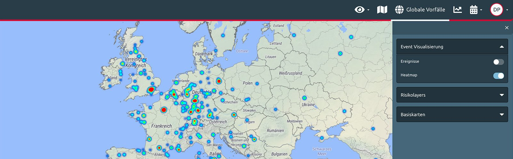

# Risk Map

## What is the Risk Map?

The Risk Map is the heart of the platform’s dynamic country information.

Zooming into the map reveals the EXOP risk ratings even below country level. It shows the risk of governorates and provinces, **down to cities and even city districts**. Having a closer look at important cities will show violet-marked **areas of higher risk for travellers**. You can select to display different information, **map types** and **layers**. 

Using events selection and event visualisation, you can generate a professional risk profile of a region based on the security incidents in the risk categories of your interest and in a certain time frame. 


It is recommended to navigate the map using the **search bar**, especially if you know exactly what you are looking for. Just enter the name of the city or other place you want to look into.


### HEAT MAP

At one glance, the **heat map** shows you hot spots of risk. Defined by your filters, it shows you which areas are to be avoided and which areas require higher security measures. A threat that was acute three years ago does not necessarily have to be present today, which is why using the time filter is **imperative to get a clear answer to your questions.**

