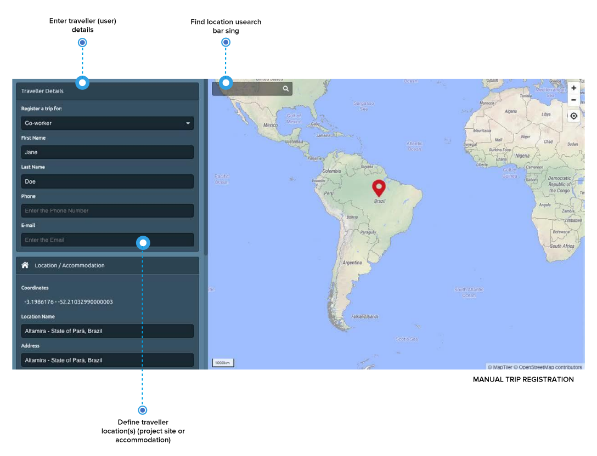
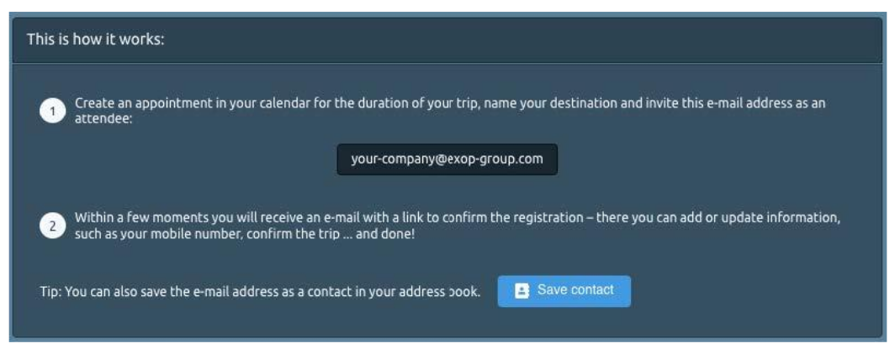

# Travel Data Integration

Many times, your travellers cannot be monitored properly because you don’t know where they are? Why not? Incomplete booking data, spelling mistakes in names, missing or wrong phone numbers and email addresses make tracking and contacting your travellers difficult. So how can we solve this problem? We provide two options to solve this problem:

1. a manual trip registration
2. a trip registration through your personal calendar

### MANUAL TRIP REGISTRATION

With the first option you can manually register your trip easily through the platform. All you need is your trip details, e.g. flight or project/office site or hotel location.

It is recommended to use the search bar to enter the accommodation location address of your stay. You can also move the pin on the map to the location you want to be monitored at during your stay. 


A huge advantage: you can also register a trip for your colleagues and team members. The only requirement is that your colleagues have a platform account.


### CALENDAR TRIP REGISTRATION



The second option is the calendar registration that allows your travellers to invite the platform to any of their appointments and trips worldwide. Travellers can invite the platform to their 3-day city trip with business meetings as well as to their visit to a project site located in a rural high-risk area and even to short stops along the road. The platform will be your travellers’ companion that informs them proactively if a security incident occurs and initiates emergency procedures, if it finds them in danger.

Simply register your trip through your personal calendar application in two simple steps– at the office with your desktop PC or on the go with your smartphone. 

1. **Create an appointment** in your calendar for the duration of your trip, name your destination and invite the company specific email address as an attendee. You will find the email address in the platform under Calendar Trip Registration. 
2. Within a few moments you will receive an email with a link to **confirm the registration**. This link leads to a confirmation page where you can directly add or update your location and contact details, such as your mobile number. Finally confirm the trip ... and done!

To summarize the benefits of using the calendar tracking :

* **QUICK — In ONLY A FEW Steps:** Register trips in two easy steps wherever you are – at the office with your desktop PC or on the go with your smartphone. Just create an appointment for the duration of your trip, invite the platform as an attendee and confirm the trip registration. 
* **EASY — Simply using YOUR PERSONAL CALENDAR:** You can register your trip easily through your personal calendar application. The platform supports any common calendar applications, including Outlook, iCal and Gmail.
* **FLEXIBLE — Your flights change? Just adapt your calender event**: You can postpone, extend or cancel the appointment in your calendar at any time. Your changes are forwarded to the platform immediately.


Please note that only travellers that have a platform account and can thus be identified, are entitled to use calendar tracking.


