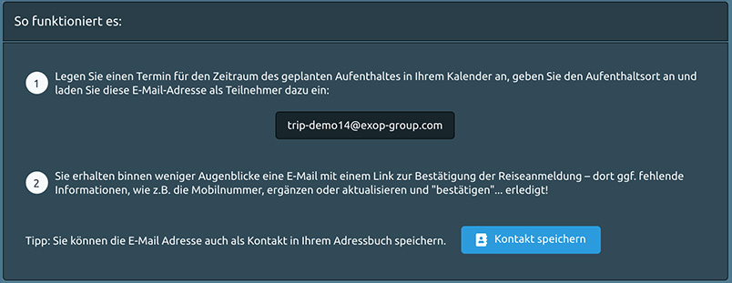

# Integration von Reisedaten

Oftmals können Ihre Reisenden nicht richtig gemonitored werden, weil Sie nicht wissen, wo sie sich befinden? Warum nicht? Unvollständige Buchungsdaten, Schreibfehler in Namen, fehlende oder falsche Telefonnummern und E-Mail-Adressen erschweren die Nachverfolgung und die Kontaktaufnahme mit Ihren Mitarbeitern. So wie können wir diese Probleme lösen? Wir bieten zwei Optionen zur Lösung dieses Problems an:

1. eine manuelle Reiseanmeldung
2. eine Reiseanmeldung über den persönlichen Kalender

### MANUELLE REISEANMELDUNG

Sie oder Ihre Mitarbeiter können Reisen einfach manuell im System registrieren. Alles, was Sie brauchen, sind die Reisedaten, z.B. Flug oder Projekt-/Bürostandort oder Hotelstandort.

Es wird empfohlen, die Suchleiste zu verwenden, um die Adresse des Unterkunftsortes für Ihren Aufenthalt einzugeben. Alternativ können Sie auch die Nadel auf der Karte an den Ort verschieben, an dem Sie während Ihres Aufenthalts verortet werden möchten. 


**Ein großer Vorteil**: Sie können auch eine Reise für Ihre Kollegen und Teammitglieder anmelden. Die einzige Voraussetzung ist, dass Ihre Kollegen im System registriert sind und ein Nutzerprofil haben.


### KALENDER REISEANMELDUNG



Die zweite Option ist die Reiseanmeldung über den Kalender, die es Ihren Reisenden ermöglicht, die Plattform zu jedem ihrer Termine und Reisen weltweit einzuladen. Dies gilt sowohl für die 3-tägige Städtereise mit Geschäftsterminen, wie auch für den Besuch eines Projektstandortes in einer abgelegenen Hochrisikoregion und sogar für kurze Zwischenstopps oder ein Abendessen. X-ASSIST wird der Begleiter Ihrer Reisenden sein, welcher sie proaktiv informiert, wenn ein Sicherheitsvorfall eintritt und Notfallmaßnahmen einleitet, wenn die Plattform sie in Gefahr sieht.

Registrieren Sie Ihre Reise einfach durch Ihre persönliche Kalenderanwendung – im Büro mit Ihrem Desktopcomputer oder unterwegs mit Ihrem Smartphone. 

1. Erstellen Sie in Ihrem Kalender einen Termin für die Dauer Ihrer Reise, nennen Sie Ihr Reiseziel und laden Sie die firmenspezifische E-Mail-Adresse als Teilnehmer ein. Sie finden die E-Mail-Adresse in der Plattform unter Kalender-Tracking. 
2. Innerhalb weniger Augenblicke erhalten Sie eine E-Mail mit einem Link zur Bestätigung der Registrierung. Dieser Link führt zu einer Webseite, auf der Sie Ihren Standort und Ihre Kontaktdaten, wie z.B. Ihre Mobiltelefonnummer, direkt hinzufügen oder aktualisieren können. Zum Schluss bestätigen Sie die Reise ... und fertig!

So fassen Sie die Vorteile der Verwendung der Kalenderverfolgung zusammen:

* **SCHNELL – In NUR WENIGEN Schritten:** Registrieren Sie Reisen in zwei einfachen Schritten, wo immer Sie sich befinden - im Büro mit Ihrem Computer oder unterwegs mit Ihrem Smartphone. Legen Sie einfach einen Termin für die Dauer Ihrer Reise an, laden Sie die Plattform als Teilnehmer ein und bestätigen Sie die Reiseanmeldung. 
* **EINFACH – Einfach mit IHREM PERSÖNLICHEN KALENDER:** Sie können Ihre Reise einfach über Ihre persönliche Kalenderanwendung registrieren. Die Plattform unterstützt alle gängigen Kalenderanwendungen, einschließlich Outlook, iCal und Gmail.
* **FLEXIBEL – Ihre Flüge ändern sich? Passen Sie einfach Ihren Termin im Kalender an**: Sie können den Termin in Ihrem Kalender jederzeit verschieben, verlängern oder absagen. Ihre Änderungen werden sofort an die Plattform weitergeleitet.


Bitte beachten Sie, dass das Kalender Tracking nur für Reisende nutzbar ist, die im System registriert sind und somit vom System identifiziert werden können.


