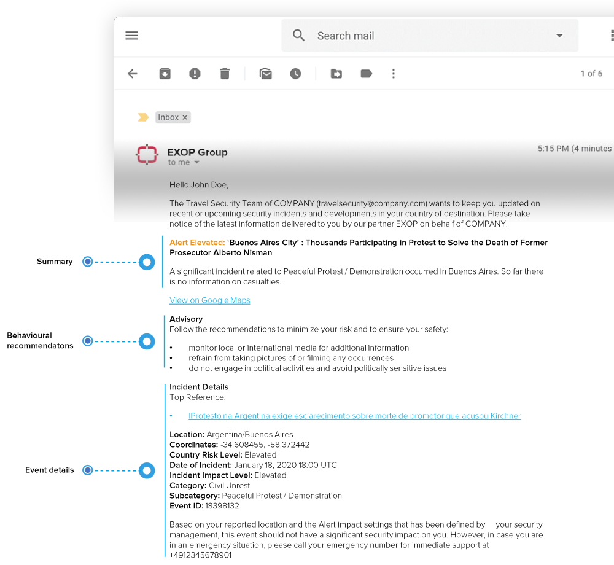
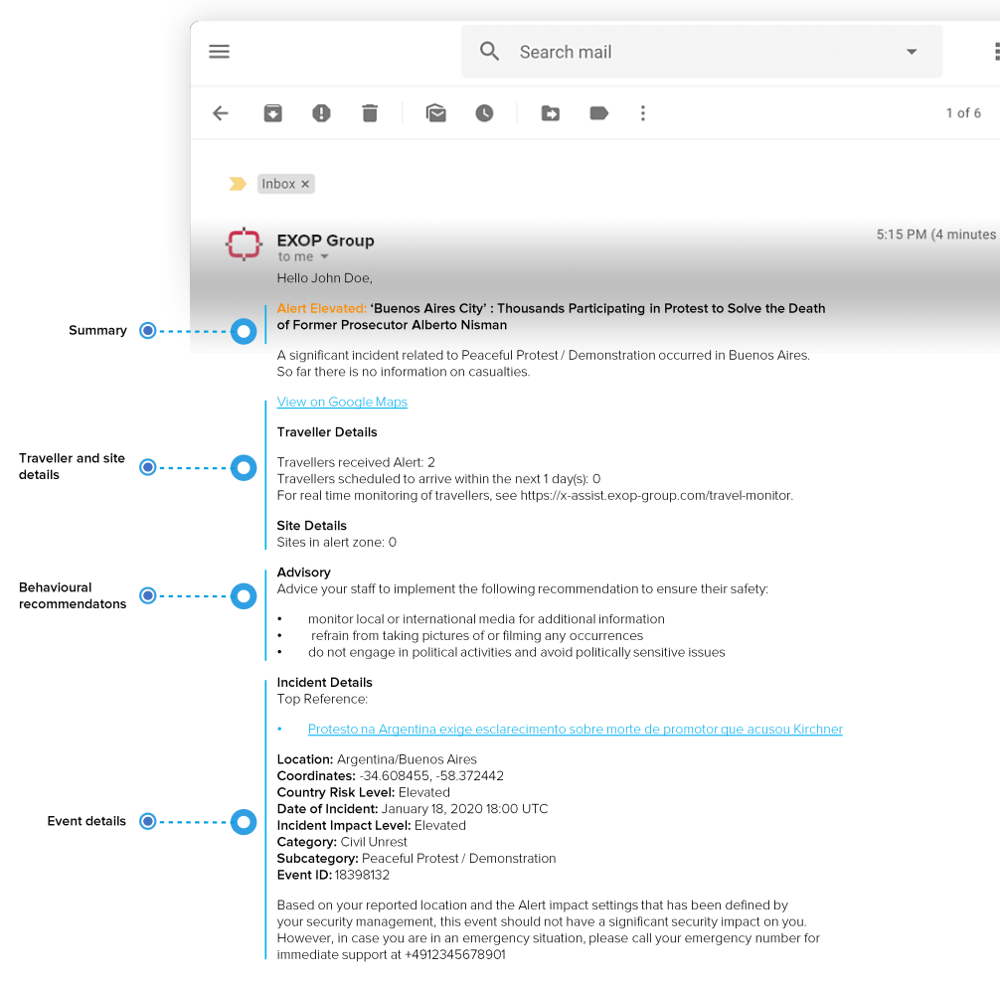
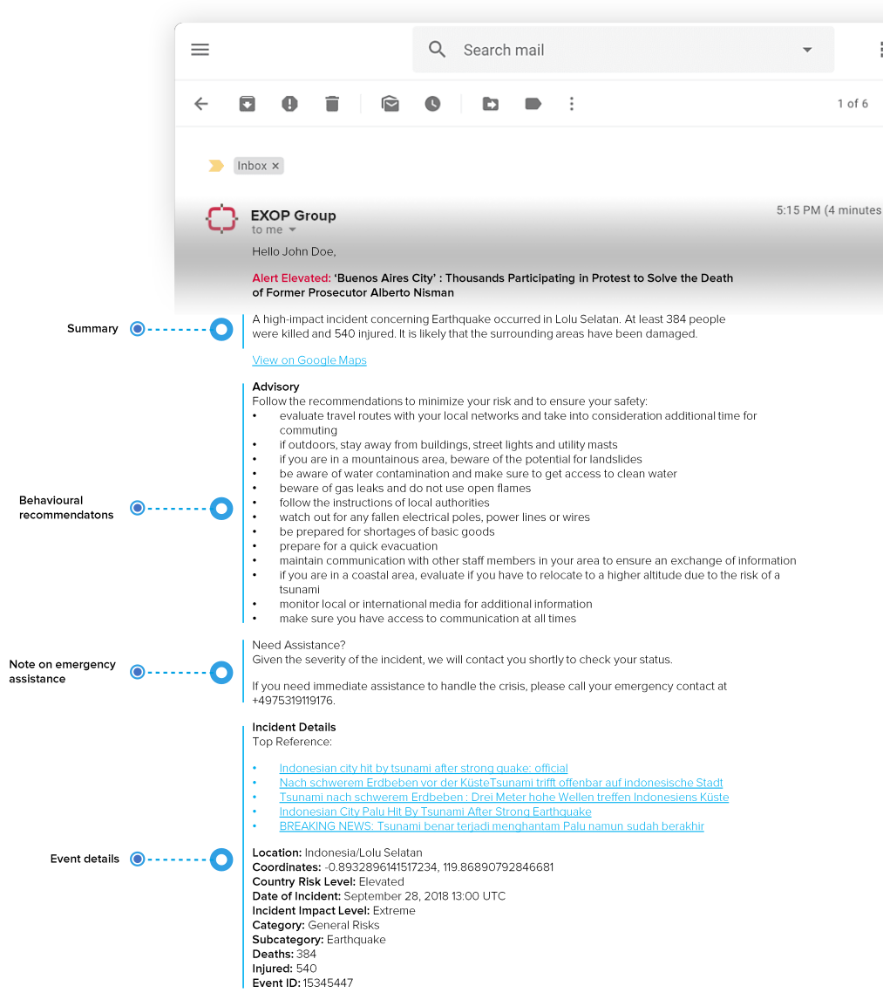
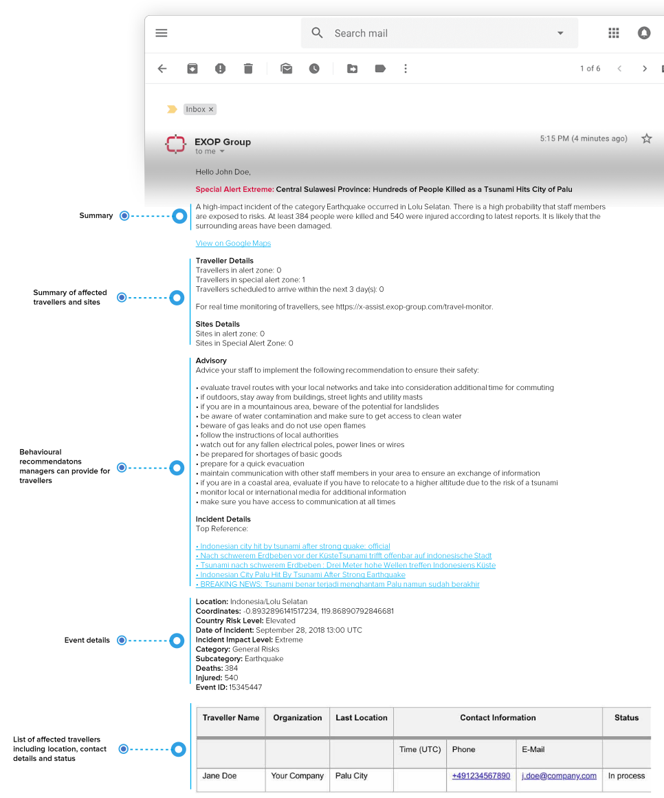

# Alerts and Special Alerts

Selecting the alert overview will directly lead you to the alerts/special alerts your travellers have received. To reduce the list of incidents displayed you can choose to show either alerts or special alerts, define a certain time frame or select a specific country using the search bar. 

The information you get in the list is mirrored on the map. Selecting an incident will provide key information on the incident such as: 

* Country of incident & headline
* Incident category/subcategory
* Incident impact score 
* References 
* Event ID 
* And the travellers affected: click on the button to display a list of those travellers that were affected by the incident, with the option to also display their traveller details. 


Please note: For more detailed information on this topic, please look at the section **alerting settings**.


## E-mail examples for Alerts and Special Alerts

### Alert for Traveller

### Alert for Manager

### Special Alert for Traveller

### Special Alert for Manager

