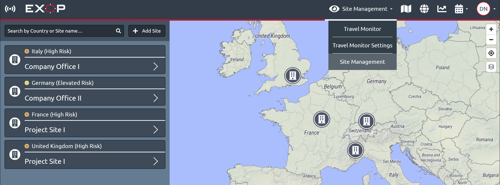
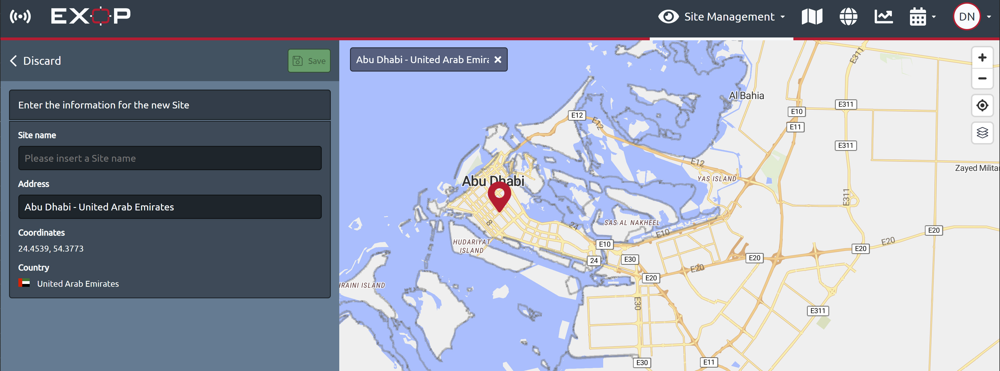

# Sites

Click the sites button in the travel monitor menu to display a list of the sites and office locations of your company, if you integrated them. Use the search bar to find a specific site. You can search for the name of a site or search by country/ countries to display multiple sites located in those countries. 

Click on a site icon on the map or on a site in the list to display the details available: the site address and the exact site location coordinates.

### Site Management - How can I integrate company sites?

If you click the travel monitor icon in the navigation bar, choose site management to access the editing panel.

If you had already some company locations integrated, you can edit or delete them easily if you click the arrow on the right side of the list entry for the site you want to edit.

You can add a new office location or project site if you click the + add site button. Use the search bar in the map to locate your relevant site and use the marker to set the exact location. Name the site and press the green save button. A green message “site added successfully” will appear.

