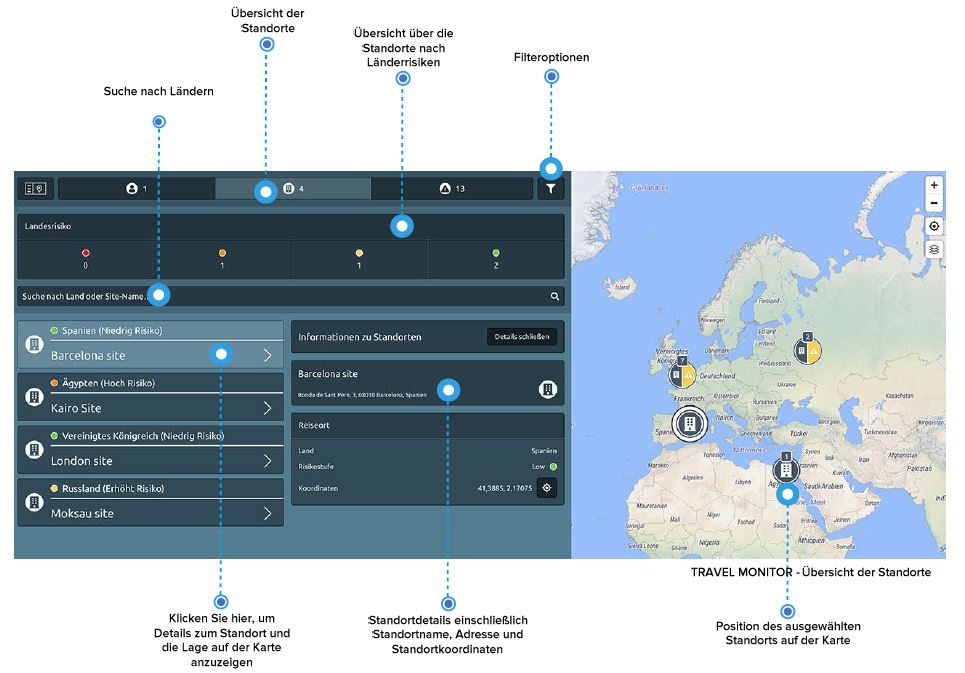

# Standorte

Wie erhalten Sie einen Überblick über Ihre Standorte? Klicken Sie auf den Button Standorte im Menü des Travel Monitors, um eine Liste der Standorte und Niederlassungen Ihres Unternehmens zu erhalten, falls Sie diese integriert haben. Verwenden Sie die Suchleiste, um einen bestimmten Standort zu finden. Sie können nach dem Namen eines Standortes oder nach Land/Ländern suchen, um mehrere Standorte in diesen Ländern anzeigen zu lassen. 

Klicken Sie auf ein Standortsymbol auf der Karte oder auf einen Standort in der Liste, um die verfügbaren Details anzuzeigen: die Standortadresse und die genauen Standortkoordinaten.

### Standortverwaltung – Wie kann ich Unternehmensstandorte integrieren?

Wählen Sie das Travelmonitorsymbol in der Navigationsleiste und klicken Sie Standortverwaltung. So gelangen Sie auf die Oberfläche zur Bearbeitung von Standorten.

Wenn Sie bereits integrierte Unternehmensstandorte haben, können Sie diese einfach bearbeiten oder löschen, indem Sie auf den Pfeil rechts im Listeneintrag des jeweiligen Standortes klicken.

Sie können auch neue Niederlassungen, Produktionsstätten, Büros oder Projektstandorte hinzufügen, indem Sie + Standort hinzufügen klicken. Tragen Sie den gewünschten Standort in das Suchfeld in der Karte ein und setzen dann den ggf. Marker an die genaue Adresse Ihres Standortes. Benennen Sie den Standort im Formular und bestätigen mit einem Klick auf Speichern.

