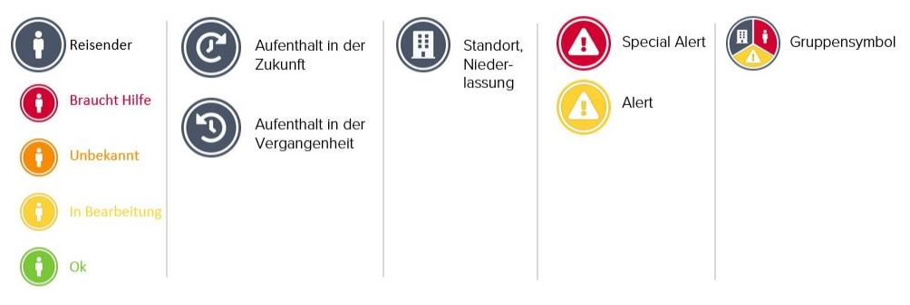

# Status und Icons

Auf der Karte des Travel Monitors finden Sie die untenstehenden Symbole. 


**Bitte beachten Sie**, dass mehrere Reisende, Standorte und Alerts am selben Ort \(je nach Zoomstufe\) in einem Symbol gruppiert sind. Klicken Sie auf das Gruppensymbol, um die verschiedenen Informationen zu jedem einzelnen Objekt zu erhalten. 


Die Symbole für Reisende haben unterschiedliche Farben, je nach ihrem **Status innerhalb der letzten 72 Stunden**: 

<table>
  <thead>
    <tr>
      <th style="text-align:left">Farbe</th>
      <th style="text-align:left">Status</th>
      <th style="text-align:left">Beschreibung</th>
    </tr>
  </thead>
  <tbody>
    <tr>
      <td style="text-align:left">Gr&#xFC;n</td>
      <td style="text-align:left"><b>Ok</b>
      </td>
      <td style="text-align:left">
        <ul>
          <li>Statusr&#xFC;ckmeldung von Reisenden im Rahmen des automatischen Statusanrufs,
            dass es ihnen gut geht</li>
          <li>Statusr&#xFC;ckmeldungen von Reisenden per E-Mail oder Telefon, dass es
            ihnen gut geht</li>
          <li>Statusr&#xFC;ckmeldung, dass es dem Reisenden gut geht, &#xFC;ber einen
            der Notfallkontakte per E-Mail oder Telefon</li>
        </ul>
      </td>
    </tr>
    <tr>
      <td style="text-align:left">Gelb</td>
      <td style="text-align:left"><b>In Bearbeitung</b>
      </td>
      <td style="text-align:left">
        <ul>
          <li>Die Serie der automatischen Statusanrufe ist noch nicht abgeschlossen.
            Es wurde noch keine Statusr&#xFC;ckmeldung gegeben.</li>
        </ul>
      </td>
    </tr>
    <tr>
      <td style="text-align:left">Orange</td>
      <td style="text-align:left"><b>Unbekannt</b>
      </td>
      <td style="text-align:left">
        <ul>
          <li>Es wurden alle Statusanrufe durchgef&#xFC;hrt und kein Status &#xFC;bermittelt
            (Telefon ausgestellt, Anrufbeantworter, keine Verbindung).</li>
          <li>Statusr&#xFC;ckmeldung erfolgt durch Dritte, also nicht durch den Reisenden
            selbst oder einen der Notfallkontakte. Der Assistance-Dienstleister informiert
            die Notfallkontakte entsprechend, inklusive Namen und Kontaktdaten.</li>
        </ul>
      </td>
    </tr>
    <tr>
      <td style="text-align:left">Rot</td>
      <td style="text-align:left"><b>Braucht Hilfe</b>
      </td>
      <td style="text-align:left">
        <ul>
          <li>Statusr&#xFC;ckmeldung von Reisenden, dass sie Hilfe brauchen als direkte
            Antwort auf den automatischen Statusanruf.</li>
          <li>Der Assistance-Dienstleister hat klare Anzeichen, dass sich die betroffenen
            Reisenden in einer kritischen Situation (Gefahr f&#xFC;r Leib, Leben oder
            Gesundheit) befinden und wird den Notfallprozess einleiten.</li>
        </ul>
      </td>
    </tr>
    <tr>
      <td style="text-align:left">Wei&#xDF;</td>
      <td style="text-align:left"><b>Kein Status</b>
      </td>
      <td style="text-align:left">
        <ul>
          <li>Reisende, die in den vergangenen 72 Stunden keinen automatischen Statusanruf
            von der Plattform erhalten haben, haben keinen Status.</li>
        </ul>
      </td>
    </tr>
  </tbody>
</table>
**Bitte beachten Sie**, dass sowohl der Status _Unbekannt_ als auch der Status _Hilfe_ darauf hindeuten, dass Reisende in Gefahr sind und Hilfe benötigen könnten. Der Assistance-Dienstleister wird den Notfallprozess einleiten, den Notfallkontakt informieren und entsprechende Folgemaßnahmen koordinieren.


