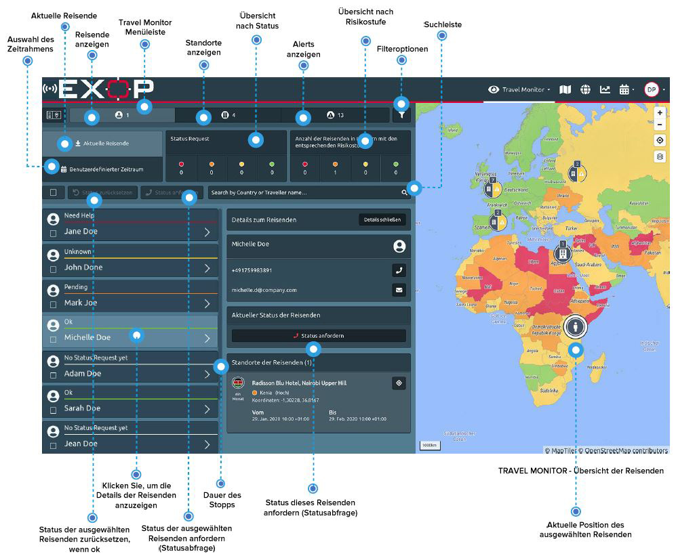

# Reisende

Sie erhalten den vollständigen Überblick über Ihre Reisenden mit einem Klick auf das Reisenden-Icon. Auf der Startseite des Travel Monitors sehen Sie auf einen Blick: 

* die aktuelle Reisestatusübersicht, die den Status der Reisenden der letzten 72 Stunden anzeigt
* die Zahl der Reisenden in Ländern mit geringem, erhöhtem, hohen und extremen Risiko

Standardmäßig zeigt Ihnen das System die Informationen zu den aktuellen Reisen an. Wenn Sie Informationen zu vergangenen oder bevorstehenden Reisen benötigen, verwenden Sie die Funktion für den benutzerdefinierten Zeitraum. Über den roten Button können Sie jederzeit eine automatische Statusabfrage für bestimmte Reisende auslösen, um sich über deren aktuellen Status zu informieren. So können Sie zum Beispiel den Status Ihrer Reisenden in Hochrisikoländer täglich abrufen. 

Klicken Sie auf ein Reisenden-Icon oder auf einen Reisenden in der Liste, um die vorhandenen Informationen anzeigen zu lassen: die Kontaktdaten und die im System registrierten Aufenthalte des Reisenden. Die verschiedenen Aufenthalte beinhalten folgende Informationen

* die Dauer jedes Aufenthalts
* den Ort \(Koordinaten und Position auf der Karte\)
* und ggf. die aktuellen Informationen über den Status

