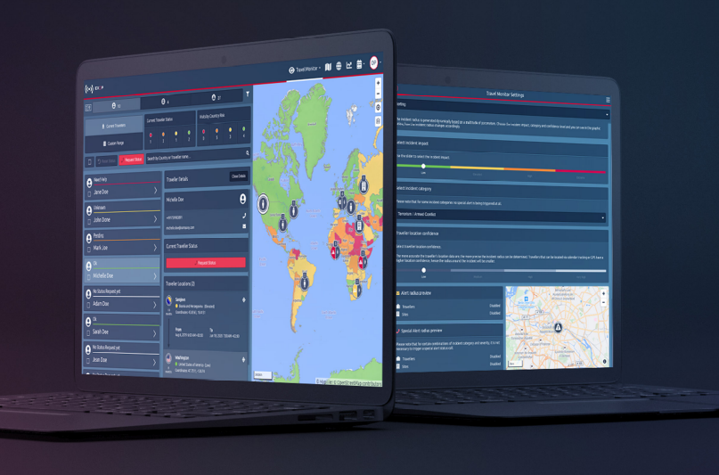
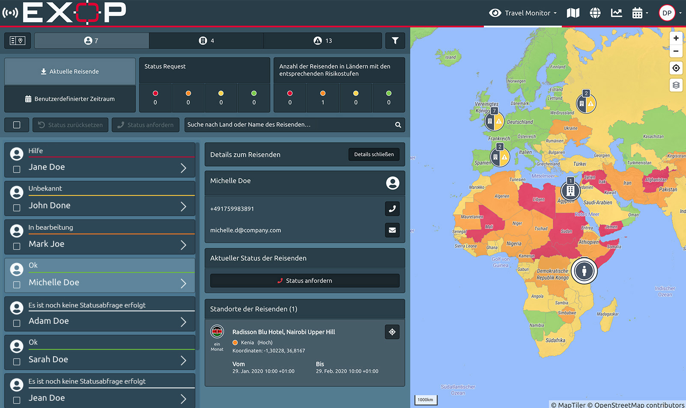
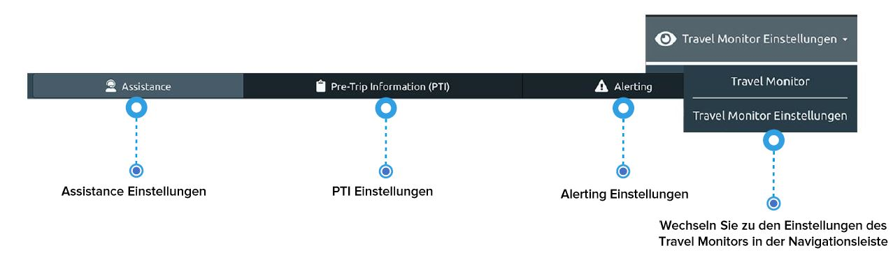

# Travel Monitor

Der **Travel Monitor** ist das Herzstück der Plattform. Travel Manager können Reisende und deren Status weltweit im Blick behalten, Notfälle verfolgen und Statusabfragen durchführen. Je nach Ihrer Einstellung steuert und definiert der Travel Monitor Alerting, Kommunikation und Sicherheitsvorfälle Ihres Unternehmens.

### Wie sieht der Travel Monitor aus?

Das Einrichten der Plattform dauert nur circa 10 Minuten. Sobald Sie alle Einstellungen definiert haben, übernimmt das System alle Arbeiten für Sie. 

Bitte nehmen Sie sich die Zeit, um Ihre Unternehmenseinstellungen folgenden drei Bereichen zu definieren: 

* Assistance
* Pre-Trip Information \(PTI\)
* Alerting


 Bitte beachten Sie, dass wir einige Standardeinstellungen vorbereitet haben, um Ihnen den Start zu erleichtern.


### Was sehe ich und wie kann ich es anwenden?

* Die wichtigsten Daten Ihres Unternehmens – **Reisende, Standorte, Alerts/Special Alerts** sowie alle **relevanten Details** dazu - können jederzeit im Travel Monitor abgerufen werden. 
* Die Standardansicht für die Desktopversion ist die 1:1 Ansicht, bei der **der Bildschirm zwischen der Navigationsleiste auf der linken Seite und der Karte auf der rechten Seite geteilt** wird. Die gesamte Navigation einschließlich ausgewählter Objekte wird in der Karte dargestellt. Wenn Sie ein Objekt in der Liste auswählen, sehen Sie nicht nur die Objektdetails in der Leiste, sondern auch den jeweiligen Standort des Objekts auf der Karte. 
* Sie können auch über die Karte navigieren, für eine **detailliertere Kartenansicht zoomen** und mit Hilfe der Ebenennavigation in der rechten oberen Ecke der Karte **zwischen mehreren Risiko- und Informationsebenen wählen**. Wenn Sie die Karte zu überfüllt finden, können Sie z.B. die Auswahl von Standorten und Alerts aufheben und so die Informationen und die Anzahl der Symbole auf der Karte reduzieren.

