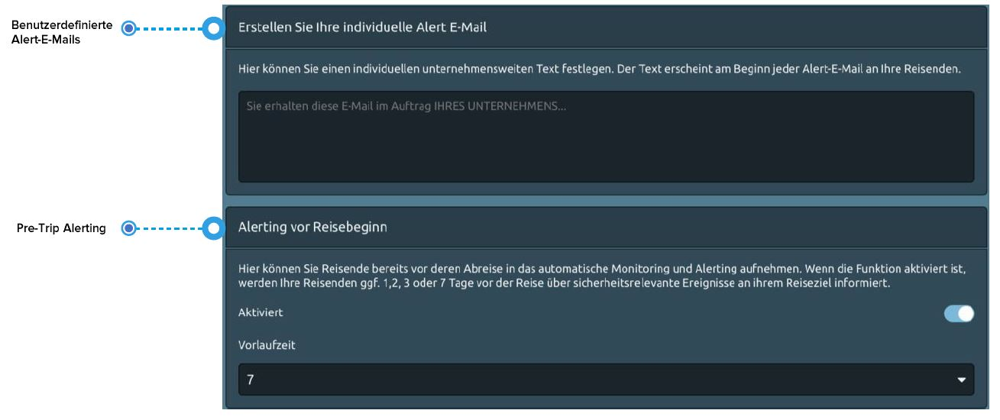
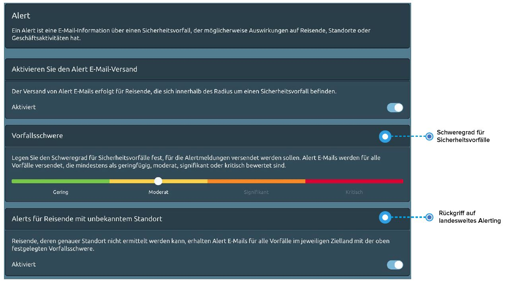
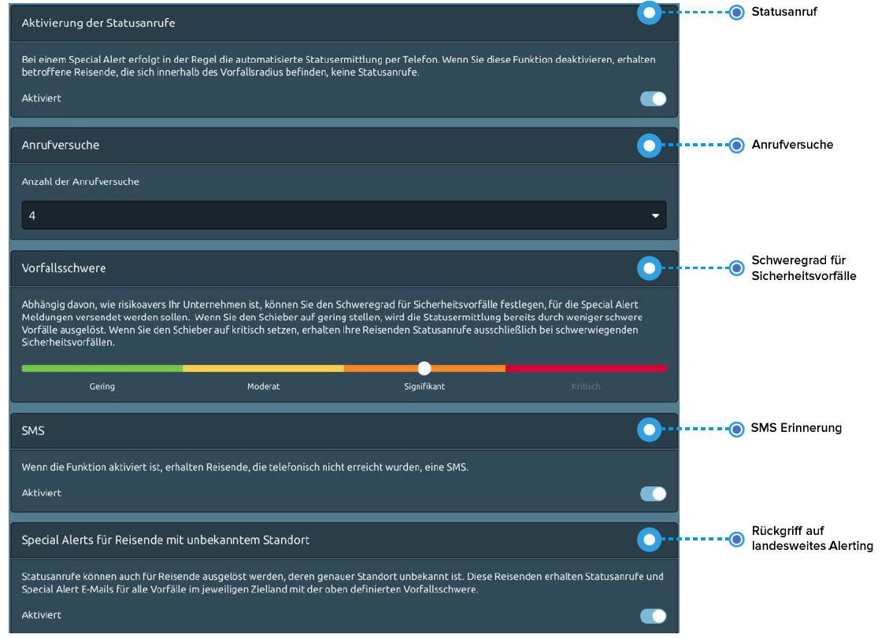
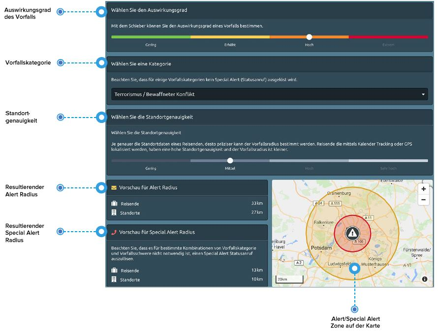

# Alerting

## Was ist das „Alerting“?

Alerting ist zunächst ein Überbegriff für Alerts und Special Alerts und deren Folgemaßnahmen:

1. Ein **Alert** ist eine E-Mail-Information über einen Vorfall, der mögliche Auswirkungen auf Reisende, Standorte oder Geschäftstätigkeiten hat. 
2. Ein **Special Alert** ist eine E-Mail-Information über einen kritischen Sicherheitsvorfall, der sich in der unmittelbaren Nähe von Reisenden befindet und daher Mitarbeiter, Standorte oder Unternehmen möglicherweise unmittelbar betrifft. Diese E-Mail enthält auch Verhaltensrichtlinien für Reisende, die sich in der Nähe eines solchen Vorfalls aufhalten. Am wichtigsten ist jedoch, dass ein **Special Alert sofort eine Reihe von automatischen Statusabfragen** bei den möglich betroffenen Reisenden auslöst, um herauszufinden, ob es ihnen gut geht oder sie Hilfe benötigen. Gleichzeitig wird das Management per E-Mail über den Status der Reisenden informiert.

## Was sind die allgemeinen Einstellungen?

Passen Sie die Alert-E-Mails an und nutzen Sie Pre-Trip Alerting. 

* Zuallererst, können Sie den **Begrüßungstext** von Alert-E-Mails, die an Ihre Reisenden gesendet werden, so **gestalten**, dass diese sie als vertrauenswürdige Nachricht ihres Arbeitgebers/Unternehmens erkennen können. Zum Beispiel: _Diese E-Mail wird im Namen IHRES UNTERNEHMENS versandt. Bitte lesen Sie die folgenden Informationen sorgfältig durch…_ 
* Sie können Reisende bereits **vor ihrer Reise in den Alerting Prozess mit einbeziehen**. Wenn die Funktion aktiviert ist, werden Ihre Reisenden ggf. 1, 2, 3 oder 7 Tage vor der Reise über sicherheitsrelevante Ereignisse an ihrem Reiseziel informiert. Es ist oft hilfreich, vor der Abreise über die Ereignisse im Land informiert zu sein, um sich entsprechend vorzubereiten, z.B. Flughafenabholung und Transport, etc. neu zu planen.

## Wie richte ich den Alert \(E-Mail\) ein? 

Ein Alert ist eine E-Mail-Information über einen Sicherheitsvorfall, der möglicherweise Auswirkungen auf Reisende, Standorte oder Geschäftstätigkeiten hat. Wenn sie das Alerting aktivieren, dann gelten die folgenden Einstellungen für Ihr Unternehmen. 

**Was ist der Schwellenwert für das Alerting?** Legen Sie den Schwellenwert für Sicherheitsvorfälle fest, für die Alert-E-Mails versendet werden sollen. Entsprechend der Einstellung des Schiebereglers erhalten Ihre Report-Empfänger und Ihre Reisenden Alert-E-Mails bei Vorfällen von mindestens **geringer, moderater, signifikanter** oder **kritischer** Schwere. 


Wenn Sie nur über die schwersten Vorfälle benachrichtigt werden wollen, stellen Sie den Schieberegler auf kritisch. Wenn Sie umfassendere Sicherheitsinformationen bevorzugen, stellen Sie den Schieberegler auf moderat.


## Wie richte ich den Special Alert \(E-Mail und Statusanruf\) ein?

Ein Special Alert wird ausgelöst, wenn ein kritischer Vorfall eintritt und sich Reisende innerhalb des Vorfallsradius befinden. In dieser Situation möchten Sie so schnell wie möglich wissen, ob es Ihren Reisenden gut geht. Im Falle eines Special Alerts werden die betroffenen Reisenden **sofort auf der im System hinterlegten Telefonnummer angerufen** \(Statusabfrage\). X-ASSIST ermittelt, ob es den Reisenden gut geht oder ob sie Hilfe brauchen, und **informiert alle Report Empfänger automatisch** per E-Mail über den aktuellen Status. Zusätzlich zur Statusabfrage erhalten Reisende auch die Vorfallsinformationen mit Handlungsempfehlungen per E-Mail.

#### Wie definiert man den Schwellenwert eines Special Alerts? 

Wie für die Alerts sollten Sie auch einen **Schwellenwert** für Sicherheitsvorfälle definieren, die bei Reisenden Ihres Unternehmens Special Alerts \(Statusabfragen und Special Alert E-Mails\) auslösen. Es kann sich von dem Alert Schwellenwert unterscheiden – je nachdem wie risikoavers Ihr Unternehmen ist. Wenn Sie den Schieber auf gering stellen, wird die Statusabfrage bereits durch weniger schwere Vorfälle ausgelöst. Wenn Sie den Schieber auf kritisch setzen, erhalten Ihre Reisenden Statusanrufe ausschließlich bei schwerwiegenden Sicherheitsvorfällen. Bitte beachten Sie, dass viele Vorfallskategorien, wie z.B. friedliche Proteste, gewaltfreie Kriminalität und ähnliches, keinen Special Alert \(Anruf\) auslösen.

#### Warum werden betroffene Reisende mehrmals angerufen? 

* Sie haben die Möglichkeit, die **Anzahl der Statusanrufe** an Ihre Reisenden in einem Notfall zu bestimmen. Oftmals werden die Reisenden den Anruf nicht sofort beantworten. Wenn man sie mehrmals anruft, mit ungefähr 5 bis 10 Minuten Abstand dazwischen, sind die Chancen größer, dass sie antworten und ihren Status mitteilen. Reisende, die nicht ans Telefon gehen \(Telefon ausgeschaltet, Voice-Mail, kein Abnehmen, keine Verbindung\) erhalten den Status "unbekannt". Notfallkontakte werden informiert und ihr Status muss weiterverfolgt werden.
* **SMS und E-Mail Erinnerung**: Reisende mit dem Status unbekannt, die nicht auf den Statusanruf geantwortet haben, erhalten eine zusätzliche E-Mail und eine SMS mit der Bitte, ihren Status zu übermitteln. Die Absicht ist, dass sie zurückrufen oder eine E-Mail an ihren Notfallkontakt schicken, sobald sie die Nachricht erhalten. Wenn Sie nicht möchten, dass zusätzlich zur E-Mail eine SMS verschickt wird, können Sie SMS deaktivieren. 
* Statusanrufe können auch für Reisende ausgelöst werden, **deren genauer Standort im Land unbekannt** ist. Diese Reisenden erhalten Statusanrufe und Special Alert E-Mails für alle Vorfälle im jeweiligen Zielland mit der oben definierten Vorfallsschwere.​

### Woher weiß ich, ob ich Alerts und Special Alerts richtig eingestellt habe?

Wenn Sie sich über Ihre Einstellungen unsicher sind oder einfach nur neugierig sind, wie die Plattform funktioniert, können Sie im Abschnitt „_Vorschau für Vorfallsradien_" nachsehen. Basierend auf einer Vielzahl von Parametern definiert die Plattform dynamisch individuelle Vorfallsradien für Alerts und Special Alerts rund um einen Sicherheitsvorfall. Zu den stärksten Parametern, die den Radius bestimmen, gehören die Auswirkung des Vorfalls, die Vorfallskategorie und die Standortgenauigkeit der Reisenden.


Testen Sie Ihre Einstellungen bevor Sie live gehen!


#### Wie können Sie Ihre Einstellungen testen? 

Verwenden Sie den Schieberegler und wählen Sie einen **Auswirkungsgrad eines Vorfalls**, legen Sie eine **Vorfallskategorie** fest und wählen Sie die **Standortgenauigkei**t: In der Grafik sehen Sie, wie sich der Vorfallsradius entsprechend ändert. 


**Bitte beachten Sie**, dass einige Vorfallskategorien keinen Special Alert \(Statusanruf\) auslösen, weil sie nie zu einer Bedrohung für Leib und Leben führen können.



**Hinweis zur Standortgenauigkeit des Reisenden:** Je genauer die Standortdaten des Reisenden sind, desto genauer kann der Vorfallsradius definiert werden. Wenn sich die Reiseanmeldung z.B. auf die Flugdaten beschränkt, wird der Reisende am Ankunftsflughafen lokalisiert. Hier ist die Standortgenauigkeit gering, da der Reisende nach der Ankunft mit hoher Wahrscheinlichkeit weiter reisen wird und nicht am Flughafen verbleibt. In diesem Fall ist der Radius um Vorfälle herum, größer. Standorte, die die Plattform über das Kalender Tracking oder GPS registriert, haben dagegen eine viel höhere Genauigkeit, daher wird der Radius um Vorfälle kleiner und das Alerting präziser.


