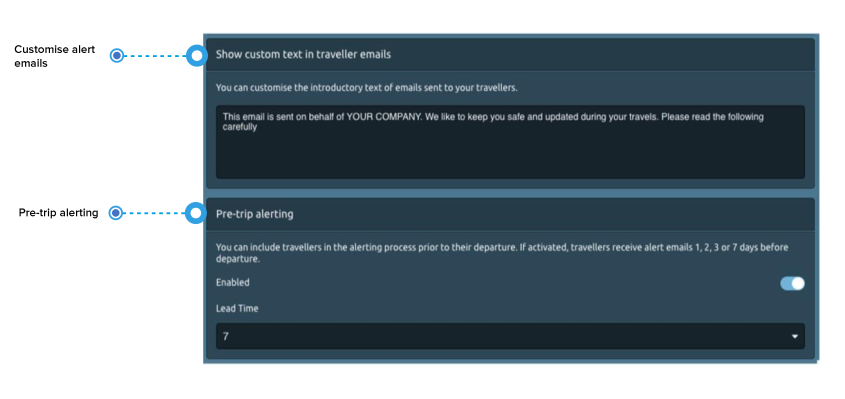
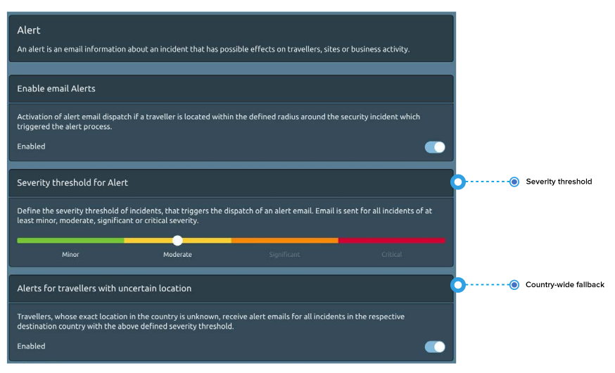
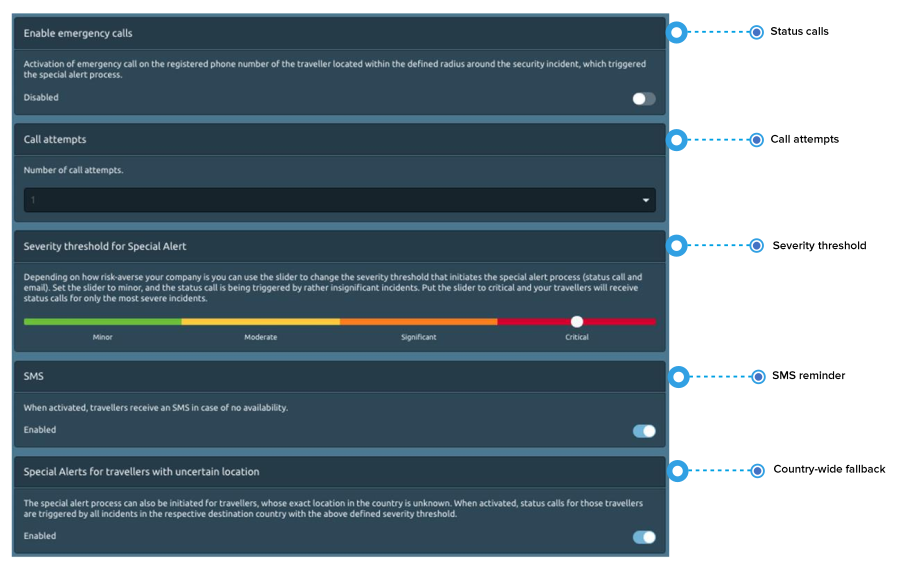
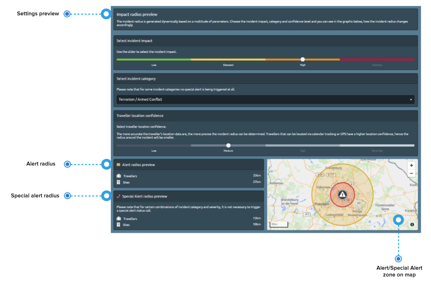

# Alerting

## What is the „Alerting“?

Alerting here, is a collective term for alerts and special alerts and their follow-up communication procedures. There are two types of alerting:

1. **Alert:** an email information about an incident that has possible effects on travellers, sites or business activities. 
2. **Special alert:** an email information about a critical security incident that occurs in the vicinity of travellers and hence likely affects staff, sites or business activities. The same email also includes behavioral guidelines for travellers that are in the vicinity of such an incident. Most importantly, a **special alert immediately triggers a series of automated status calls** to those likely affected travellers in order to find out if they are ok or need assistance.

## What are the general settings?

Customise alert emails and use pre-trip alerting. 

* First of all, you can **customise the introductory text of alert emails** sent to your travellers, so they can recognise them as a trustworthy message from their employer/company. For example: _This email is sent on behalf of YOUR COMPANY. We like to keep you safe and updated during your travels. Please read the following carefully…_ 
* You can include travellers in the **alerting process prior to their trip**. If activated, travellers receive alert emails 24h, 48h, 72h or 7 days before travel. It is often helpful to be informed about what happens in the country before departure to prepare accordingly e.g. re-arrange meet and greet etc.

## How do I set the alert \(email\)? 

An alert is an email information about an incident that has possible effects on travellers, sites or business activity. Activate the alerting and the following settings will apply for your company. 

**What is the alert threshold?** You can define the severity threshold for incidents that trigger the dispatch of alert emails. Depending on where you set the slider, your report recipients and your travellers will receive alert emails for incidents of at least **minor, moderate, significant or critical severity**. 


If you want the travellers to be alerted only about the most severe incidents, set the slider to critical. If you prefer broader security information, set the slider to moderate.


## How do I set up the special alert \(email and status call\)?

A special alert is triggered, if a critical incident occurs and your travellers are nearby, inside the impact zone of the incident. In this case, you want to know as quickly as possible if your travellers are ok. In the event of a special alert, **affected travellers are called on their registered phone number** in order to find out their status \(status call\). The platform will find out if a **traveller is ok or needs help** and will inform report recipients automatically. In addition to the status call, travellers also receive the incident information with recommendations via email.

#### How to define the special alert threshold? 

You also define the severity threshold for incidents that trigger special alerts \(status call and special alert email\) for your company’s travellers. It can be different from the alert threshold – depending on how risk-averse your company is. Set the slider to minor and status calls are triggered by rather insignificant and non-life-threatening incidents. Set the slider to critical and the automated status detection is triggered only by the most severe incidents. Please note that many incident categories, such as peaceful protest, non-violent crime and the like, by nature do not trigger a special alert status call.

#### What else can I define to alert travellers? 

* You can determine the **number of status calls** to your travellers in an emergency. Often travellers will not answer the call immediately. Calling them several times with some 5 to 10 minutes in between, means better chances that they answer and give their status information. Travellers that do not answer the phone \(phone switched off, voice mail, no pick-up, no connection\) are assigned the status “unknown”. Emergency contacts will be informed, and their status must be followed-up on.
* **SMS and email reminder**: Unknown travellers who did not answer the status call, will receive an email and an SMS with a request to provide their status information. The idea is to have them call back or send an email to their emergency contact as soon as they receive the message. If you do not want an SMS to be sent in addition to the email, you can switch it off. 
* The special alert process can also be initiated for travellers whose **exact position in the country is unknown**. When activated, status calls are triggered by all incidents in the respective destination country with the above defined severity threshold.​

### How do I know if I set Alerts and Special Alerts right?

If you are uncertain about your settings or just curious, how the platform works, you can check and see in the section called “_incident radius preview_”. Based on a multitude of parameters, the platform dynamically defines individual impact radii for alerts and special alerts around a security incident. Among the strongest parameters shaping the radius are the incident impact, the incident category and the traveller location confidence.


Test your settings before going live!


#### How to do it? 

Use the slider and choose an **incident impact value**, choose an **incident category** of your interest and pick a **confidence level**: In the graphic above you can see how the incident radius changes accordingly. 


Please note that some incident categories, by nature do not trigger a special alert status call.



**Note on the traveller location confidence:** The more accurate the traveller’s location data are, the more precisely the incident radius can be defined. If travel registration is limited to flight data for example, the traveller will be located at the arrival airport, which is a location of only low confidence, as the traveller is likely to move on after arrival. Therefore, the platform draws a larger radius around incidents. Travellers using calendar tracking or GPS, on the other hand, have much higher location confidence, hence the radius around incidents will be smaller and the alerting is more precise.


