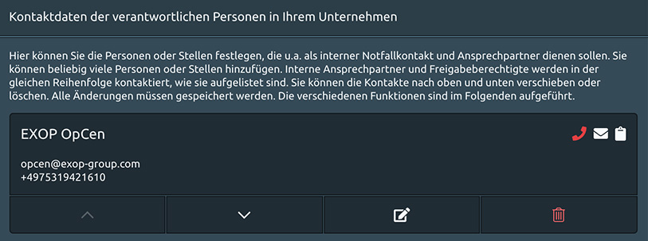

# Assistance Einstellungen

## Wer soll die 24/7 Assistance für Sie übernehmen?

Wenn Ihre Reisenden Hilfe benötigen, dann brauchen sie EINE Kontaktstelle und EINE Telefonnummer, die sie um Hilfe rufen können. In diesem Abschnitt wählen Sie den ersten Notfallkontakt für Ihr Unternehmen aus. Es wird die Nummer, welche Ihre Mitarbeiter weltweit und 24/7 unterstützt. 

Die Plattform bietet Ihnen zwei Möglichkeiten. Einzelheiten siehe unten: 

1. EXOP Operationszentrale
2. Ihren eigenen Notfallkontakt

### 1. EXOP OPERATIONSZENTRALE

Die EXOP-Operationszentrale wird 24/7 Notfallunterstützung für Sie leisten. 

* Reisende, die auf die automatische Statusabfrage mit "Hilfe" antworten, werden direkt an die EXOP-Operationszentrale weitergeleitet. 
* Die Telefonnummer der EXOP-Operationszentrale wird in der gesamten E-Mail-Kommunikation im Zusammenhang mit Reisesicherheit und Assistance als Notrufnummer angezeigt.

### 2. IHREN EIGENEN NOTFALLKONTAKT

You can also choose to provide your own emergency setup.

* Reisende, die den automatisierten Statusanruf mit „Hilfe“ beantworten, werden an die von Ihnen angegebene individuelle Telefonnummer weitergeleitet.
* Die Telefonnummer des ersten Notfallkontaktes wird in der gesamten E-Mail-Kommunikation im Zusammenhang mit Reisesicherheit und Assistance als Notrufnummer angezeigt.


Bitte beachten Sie, dass EXOP in diesem Fall nicht in die Notfallkommunikation einbezogen wird. Wenn „Kunde“ ausgewählt ist, dann wird die Telefonnummer des ersten Notfallkontaktes unten als Notfallnummer verwendet.


