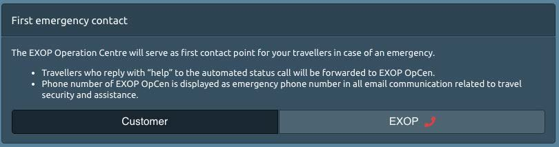
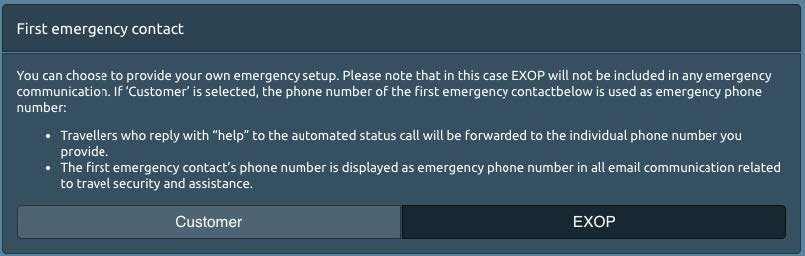
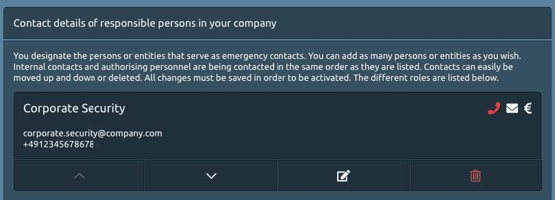

# Assistance Settings

## Who do you want to handle 24/7 assistance for you?

When your travellers need assistance, they need **ONE contact point**, **ONE phone number** they can call for help. In this section you select the first emergency contact point for your company. It will be this number that supports your staff 24/7 and worldwide. 

The platform leaves you two options detailed below: 

1. EXOP Operation Center
2. Your Own Emergency Setup

### 1. EXOP OPERATION CENTER

The EXOP Operation Center will handle 24/7 emergency assistance for you. 

* Travellers who reply with “help” to the automated status call will be forwarded to the EXOP Operation Centre. 
* The phone number of the EXOP Operation Centre is displayed as emergency phone number in all email communication related to travel security and assistance. 

### 2. YOUR OWN EMERGENCY SETUP

You can also choose to provide your own emergency setup.

* Travellers who reply with “help” to the automated status call will be forwarded to the individual phone number you provide.
* The first emergency contact’s phone number is displayed as emergency phone number in all email communication related to travel security and assistance.


Please note that in this case EXOP will not be included in any emergency communication. If ‘Customer’ is selected, the phone number of the first emergency contact is used as emergency phone number.


