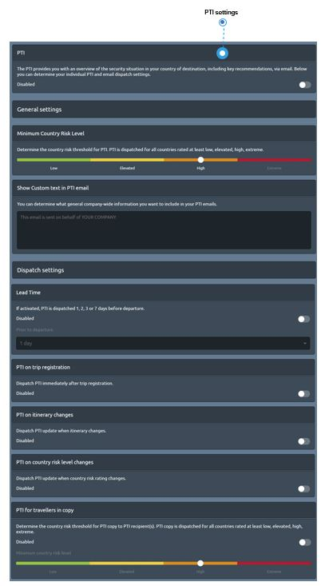

# Pre-trip Information

## How can I follow-up on the country information my travellers receive before the trip begins?

Pre-trip information \(PTI\) provide an overview of the risk situation in a country of destination, including key recommendations. More specifically, there is a PTI for each country the traveller visits during a trip, including departure and transit countries. 

**PTI are delivered via email, before departure**. According to your company needs, you can determine the following PTI and email dispatch _settings_.

### KEY FEATURES AND SETTINGS

* **PTI is sent to the registered email** address of travellers, unless you deactivate PTI.
* **You can customise the introductory text of PTI emails** sent to your travellers, so they can recognise them as a trustworthy message from their employer/company. For example: This email is sent on behalf of YOUR COMPANY. Please read the following information on your destination country carefully…. Have a nice trip.
* **Determine the country risk threshold for PTI.** PTI is dispatched for all countries rated at least low, elevated, high, extreme. This way you can, for example, avoid PTI for low risk destination countries.
* **Determine the country risk threshold for report recipients**. A copy of the PTI is dispatched for all countries rated at least low, elevated, high, extreme. You can receive a copy of all traveller PTIs. This way you are not only informed about everyone’s travels, but also have proof of having fulfilled your duty of care.
* **Receive PTI immediately after trip registration**: This is a nice feature for travellers that want to be sure that their trip registration was successful. If you get a copy, this feature allows you to be informed immediately after the travel booking or travel registration.
* Lead time: **You can choose to dispatch the PTI 24h, 48h, 72h or 7 days before departure**. According to your company regulation, you can define how many days before departure your travellers shall receive the information and have enough time to prepare accordingly. If, according to your above setting, a PTI is sent immediately after trip registration, this can be an additional reminder.
* **Receive PTI update when itinerary changes**: Travel bookings can be complex at times, especially when an existing PNR is changed. Dates, times, airlines or destinations and stops can be changed and added, etc. Choose this feature to make sure, your travellers are comprehensively informed by the PTI in case of travel booking changes.
* **Dispatch PTI update when country risk rating changes**: Your company travel regulations might foresee different processes for destination countries depending on their risk rating. With this feature, you can follow-up on travels to countries when their risk escalates, even after the booking has been done, and can adjust security measures, if required.
* **Ignore departure airports**: When this setting is enabled, no PTI will be triggered by stays at a departure airport. PTI will only be sent for destination countries.
* **Exclude PTI for country of employment**: When this setting is enabled, travellers will not receive PTI for stays in or travels to their country of employment. Please note that users candetermine their personal country of employment in the user profile, which will overrule the company-wide default country that administrators shall communicate to their key account manager, if they want to make use of this setting. To give an example: Germany-based companies may like to exclude PTI for Germany in general. An employee of the same Germany-based company may work in France. He can exclude to receive PTI for France by setting up his user profile accordingly. Minimum stay duration: You can determine that for short stays \(e.g. transit\) no PTI shall be sent to the traveller. If activated, stays which are shorter than 1, 2, 4 or 8 hours will not trigger a PTI.

